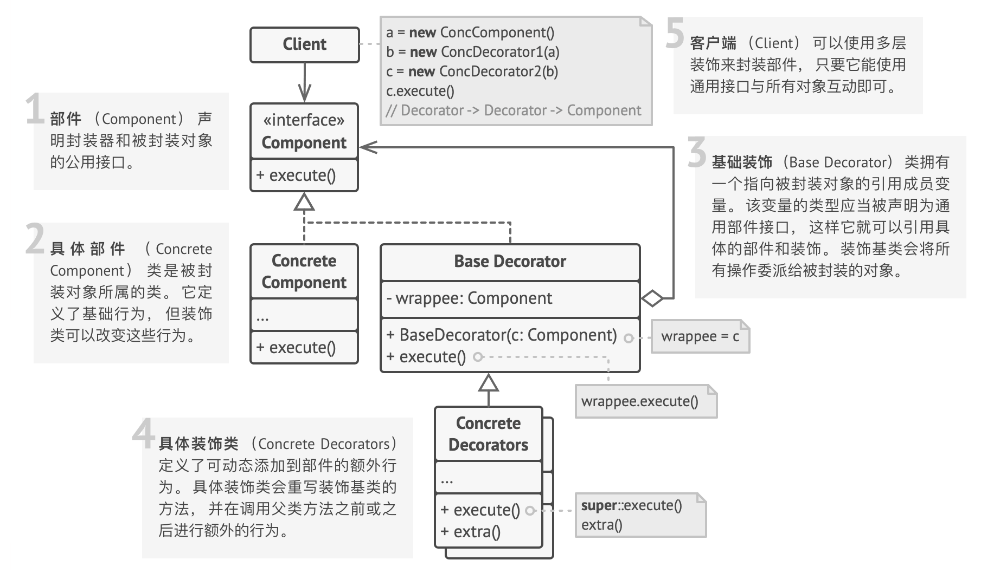

## 装饰模式结构




## Demo 解释说明

在本 Demo 中, Client 实际上可以视为 Demo 类, 
在 Demo 类中通过接口 DataSource 提供的 read 和 write 对文件进行操作。
对于 DataSource 这个接口, 我们实现了两个类, 一个负责作为所有 Decorator 的基类, 
另一个负责作为 DataSource 的直接实现类 FileDataSource, 负责对文件直接进行访问和写入操作。
这样一来就可以使用这些派生的 Decorator 对 FileDataSource 进行装饰。

Demo 输出:

```bash
- Try write encoded data -
execute -> CompressionDecorator.writeData
execute -> DataSourceDecorator.writeData
execute -> EncryptionDecorator.writeData
execute -> DataSourceDecorator.writeData
execute -> FileDataSource.writeData
```

在这段代码中:

```java
DataSourceDecorator encoded =
    new CompressionDecorator(                               // 压缩装饰器
        new EncryptionDecorator(                            // 加密装饰器
            new FileDataSource("OutputDemo.txt")   // innerDataSource
        )
    );
System.out.println("- Try write encoded data -");
encoded.writeData(salaryRecords);
```

首先执行派生类装饰器 CompressionDecorator

再执行父类装饰器 DataSourceDecorator

-> 父类装饰器发现内部的 innerDataSource 实际上是由 EncryptionDecorator 实现的

因此执行派生类装饰器 EncryptionDecorator

再执行父类装饰器 DataSourceDecorator

-> 父类装饰器内发现内部的 innerDataSource 实际上是 FileDataSource 实现的

最终直接执行 FileDataSource 的写入方法